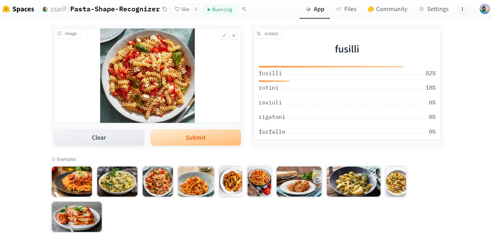

# Pasta Shape Recognizer

An image classification model that utilizes data collection, augmentation, model training, cleaning, deployment and API integration to classify 20 different types of pasta shapes. The types are following:

<table style="width: 100%;">
    <tr>
        <td>1. Spaghetti</td>
        <td>2. Fettuccine</td>
        <td>3. Penne</td>
        <td>4. Rigatoni</td>
    </tr>
    <tr>
        <td>5. Fusilli</td>
        <td>6. Farfalle</td>
        <td>7. Linguine</td>
        <td>8. Tagliatelle</td>
    </tr>
    <tr>
        <td>9. Lasagna</td>
        <td>10. Ravioli</td>
        <td>11. Tortellini</td>
        <td>12. Orecchiette</td>
    </tr>
    <tr>
        <td>13. Conchiglie</td>
        <td>14. Rotini</td>
        <td>15. Bucatini</td>
        <td>16. Cannelloni</td>
    </tr>
    <tr>
        <td>17. Macaroni</td>
        <td>18. Orzo</td>
        <td>19. Cavatappi</td>
        <td>20. Gemelli</td>
    </tr>
</table>

## Build from Source

### Clone the repo

```bash
git clone https://github.com/zzarif/Pasta-Shape-Recognizer.git
```

### Install CUDA Toolkit

- Go to the NVIDIA CUDA Toolkit download page: https://developer.nvidia.com/cuda-downloads
- Select "Windows" as the operating system and choose the appropriate version and installer type.
- Download and run the installer, following the installation instructions.

### Initialize and activate virtual environment

```bash
virtualenv --no-site-packages venv
source venv/Scripts/activate
```

### Install PyTorch with CUDA support

Run the following command to install PyTorch with CUDA support using `pip3`:

```bash
pip3 install torch torchvision torchaudio --index-url https://download.pytorch.org/whl/cu121
```

_Note: Replace `cu121` with the appropriate CUDA version tag that matches your installed CUDA version (e.g., `cu121` for CUDA `12.1`)._

### Verify the installation

Run the following code to check if PyTorch is using the GPU:

```python
import torch
print(torch.cuda.is_available())
```

If the output is `True`, then PyTorch is successfully set up to use the GPU. `torch.cuda.get_device_name(0)` should also show your GPU config.

### Install Dependencies

```bash
pip3 install fastai fastbook nbdev gradio
```

## Dataset Preparation

- **Data Collection:** The code collects images for each pasta shape by searching for them using the DuckDuckGo search engine and downloading the images to corresponding folders in the [data](data/) directory. It then verifies the downloaded images and removes any failed downloads.
- **DataLoader:** The code creates a DataBlock, which defines the structure of the data, including the image and label blocks, data splitting strategy, and image transformations. It then creates a DataLoader (dls) using the DataBlock, specifying the path to the data and the batch size.
- **Data Augmentation:** The code applies data augmentation techniques to the images using RandomResizedCrop, which randomly crops and resizes the images to a specified size (224x224) with a minimum scaling factor of 0.5. Additional augmentation transforms are applied using aug_transforms() to further enhance the variety of the training data.
  Details can be found in [data_prep.ipynb](notebooks/data_prep.ipynb)

## Training and Data Cleaning

- **Training:** The model is trained using a ResNet34 architecture with a 90-10 train-validation split, and fine-tuned for 5 epochs initially, achieving `~75%` accuracy. After data cleaning, the model is fine-tuned for 2 more epochs, reaching `79.5%` accuracy, and then further fine-tuned for 2 epochs, achieving a satisfactory accuracy of `~85.6%`.
- **Data Cleaning:** The `ImageClassifierCleaner` is used to identify and remove irrelevant data points from the dataset. The data points that need to be relabeled are moved to the correct directories, ensuring the dataset's integrity and improving the model's performance.
  Details can be found in [training_and_data_cleaning.ipynb](notebooks/training_and_data_cleaning.ipynb)

## Model Deployment

The model is deployed to HuggingFace Spaces Gradio App. The implementation can be found in [deployment](deployment/) folder or [here](https://huggingface.co/spaces/zzarif/Pasta-Shape-Recognizer).

### Classifying `fusilli` pasta



## API integration with GitHub Pages

The deployed model API is integrated [here](https://zzarif.github.io/Pasta-Shape-Recognizer/) in GitHub Pages Website. Implementation and other details can be found in `docs` folder.

### Contact Me

Would appreciate your feedback. For any further queries feel free to reach out to me at [zibran.zarif.amio@gmail.com](mailto:zibran.zarif.amio@gmail.com)
